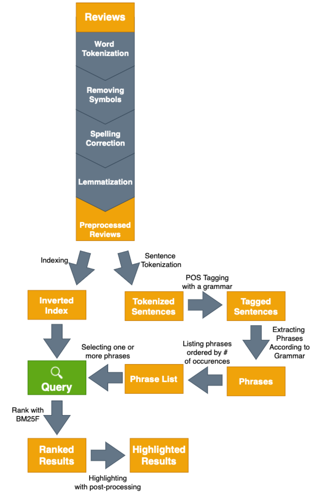

# Product Review Categorizer
This project aims to automatically generate sub-categories using phrases extracted by online product reviews. After
these sub-categories are generated, they are indexed using [Whoosh](https://whoosh.readthedocs.io/en/latest/). RESTful
API is then exposed using [Flask](https://flask.palletsprojects.com/en/2.0.x/), where one or more of extracted 
sub-categories can be selected to view related product reviews under category in ranked fashion. More details can be
seen under Details section below.

## Dataset

Dataset used in this project is [Amazon Reviews Dataset](https://nijianmo.github.io/amazon/index.html). For simplicity
50.000 reviews under `Headphones` category are extracted and utilized. Pyhton 3.9 and Conda environment with 
dependencies as given in requirements.txt is used.

## Usage
Following commands should be run in order to successfully start RESTful web service in the end. Note that more
detailed information on each command can be found using -h option, following calls run with default parameters.

1. Extract 50.000 `Headphones` reviews.
```
python3 src/utils/review_extraction.py 
```

2. Preprocess reviews and generate sub-categories.
```
python3 src/corpus_generation/review_preprocessor.py
```

3. Create Whoosh index using created sub-categories.
```
python3 src/search/phrase_search.py create_index
```

4. Start serving Flask app
```
python3 src/api/app.py
```

## API Description

1. Get most popular 50 phrases: `GET /headphones/phrases`

Result:
```
{"phrases": ["phrase1", "phrase2", ..]}
```

2. Get search results for selected sub-categories: `GET /headphones/search`

Query Parameters

- phrases: sub-categories (phrases) to run search on, seperated by commas
- limit: number of search results that should be returned at maximum
- parser_type: type of search parser to apply, possible values:
  - and_type: return results that have all phrases provided in phrases parameter 
  - or_type: otherwise

Example run:

- `/headphones/search?phrases=sound%20quality,volume%20control&limit=10&parser_type=and_type`

Result:
```
[{Review rank 1}, {Review rank 2}, ..]
```

Each review consists of following parts:

- Review ID
- Review Text
- Related Product ID
- Ranking Score
- Overall Star Rank
- Title
- Image URL
- Highlight Indices: list of beginning and ending indices that contain query terms to highlight in frontend

Note that there are also POST version of `/headphones/search` for convenience as number of query terms can get large,
and it is sometimes better to use headers instead of query parameters.

## Details

Following flow diagram describes the overall flow of the Product Review Categorizer:



## License
[MIT](https://choosealicense.com/licenses/mit/)

